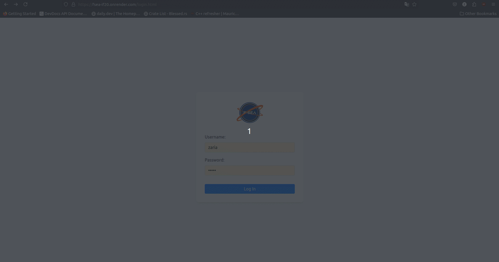

# FSEA Database Project

## Table of Contents

- [Overview](#overview)
- [Built With](#built-with)
- [Features](#features)
- [Contact](#contact)
## Overview
<!-- Add a screenshot of the live project.
    1. Link to a 'live demo.'
    2. Describe your overall experience in a couple of sentences.
    3. List a few specific technical things that you learned or improved on.
    4. Share any other tips or guidance for others attempting this or something similar.
 -->

Project FSEA (Federal Space Exploration Association) is a passion project, based on one of my fictional stories, that serves as an info-base for the association. It is currently bare-bones, but I plan to add much more functionality. 

The main objective of this project is to develop a more in-depth understanding of database design and web application development. 

**Link to demo:** https://fsea-if20.onrender.com/login.html \
Username: zaria\
Password: admin

### Built With
<!-- List any MAJOR libraries/frameworks (e.g. React, Tailwind) with links to their homepages. -->
**Frontend**
- ViteJS

**API**
- Flask
- GraphQL
- SQLAlchemy

**Database**
- PostgreSQL

## Features
<!-- List what specific 'user problems' that this application solves. -->
### Current
- user login
- view department directory
- view specimen directory
- view origin directory
- database search

### Planned
- dashboard graphs/metrics
- access control
- page editing
- pdf generation
- document search/access

## Contact
<!-- Include icons and links to your RELEVANT, PROFESSIONAL 'DEV-ORIENTED' social media. LinkedIn and dev.to are minimum. -->
**LinkedIn:** https://www.linkedin.com/in/zariaburton/

## License

This project is licensed under the [MIT License](LICENSE).

