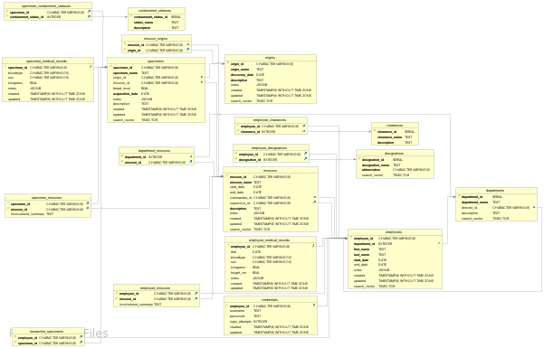

# FSEA Database Documentation

### Index

- [Overview](#overview)
- [Schema Overview](#schema-overview)
- [Tables](#tables)
  - [Clearances](#table-clearances)
  - [Containment Statuses](#table-containment-statuses)
  - [Departments](#table-departments)
  - [Designations](#table-designations)
  - [Employees](#table-employees)
  - [Employee Clearances](#table-employee-clearances)
  - [Employee Designations](#table-employee-designations)
  - [Employee Medical Records](#table-employee-medical-records)
  - [Missions](#table-missions)
  - [Origins](#table-origins)
  - [Mission Origins](#table-mission-origins)
  - [Specimens](#table-specimens)
  - [Specimen Containment Statuses](#table-specimen-containment-statuses)
  - [Specimen Medical Records](#table-specimen-medical-records)
  - [Specimen Missions](#table-specimen-missions)
  - [Credentials](#table-credentials)
  - [Department Missions](#table-department-missions)
  - [Employee Missions](#table-employee-missions)
  - [Researcher Specimens](#table-researcher-specimens)
- [Functions and Stored Procedures](#functions-and-stored-procedures)
  - [Search Employee Details](#function-search-employee-details)
  - [Search Department Details](#function-search-department-details)
  - [Search Origin Details](#function-search-origin-details)
  - [Search Mission Details](#function-search-mission-details)
  - [Search Specimen Details](#function-search-specimen-details)
  - [Update Modified Column](#function-update-modified-column)
  - [Create Employee Records](#function-create-employee-records)
  - [Create Specimen Medical Record](#function-create-specimen-medical-record)
  - [Generate Unique ID](#function-generate-unique-id)
  - [Insert Employee ID](#function-insert-employee-id)
  - [Insert Specimen ID](#function-insert-specimen-id)
  - [Insert Mission ID](#function-insert-mission-id)
  - [Insert Origin ID](#function-insert-origin-id)
- [Triggers](#triggers)
  - [Update Triggers](#update-triggers)
  - [Insert Triggers](#insert-triggers)
- [Access and Security](#access-and-security)
- [Backup and Recovery](#backup-and-recovery)
- [Change Log](#change-log)


## Overview

As a lover of sc-fi, this database is a passion project of mine that resulted from a fictional story of what happened after a catclysmic event occured on Earth, causing humanity to search for a new home.

The primary purpose of this database is to serve as the backbone of FSEA's (Federal Space Exploration Association) information database application. This database holds a wealth of information about FSEA, it's employees, and its endeavors; and there is surely more to come.

## Schema Overview


## Tables

Document each table in your database, including a description of its purpose, its relationships with other tables, and any specific considerations (e.g., indexing strategies).

### Table: `clearances`

- **Description**: Holds information about various clearance levels that can be assigned to employees, reflecting their access rights or levels of confidentiality they are entrusted with. Each clearance level is described by a name and a detailed description.

- **Columns**:
  - `clearance_id` (INTEGER): Unique identifier for the clearance level.
  - `clearance_name` (TEXT): The name of the clearance level, which identifies the level of access or confidentiality.
  - `description` (TEXT): Provides a detailed explanation of what the clearance level entails, including the responsibilities and access rights associated with it.

- **Indexes**:
  - Primary Key on `clearance_id`.

- **Relationships**:
  - Referenced by `employee_clearances`: This table's `clearance_id` acts as a foreign key in the `employee_clearances` table, establishing a relationship where employees are granted specific clearances. This setup allows for tracking which clearance levels are assigned to each employee.

- **Referenced by**:
  - `employee_clearances` table through the `clearance_id` column, with a Foreign Key constraint named `employee_clearances_clearance_id_fkey`. This constraint links each entry in `employee_clearances` to a valid clearance level defined in this table. The `ON DELETE CASCADE` rule ensures that if a clearance level is deleted, all associated entries in `employee_clearances` are also automatically removed to maintain data integrity.


### Table: `containment_statuses`

- **Description**: Stores containment statuses that specimens may possibly have. Each status provides a named containment level (e.g., "Secure", "Quarantine", "Released") and a description for further detail.

- **Columns**:
  - `containment_status_id` (INTEGER): Unique identifier for the containment status.
  - `status_name` (TEXT): Name of the containment status, indicating the level or type of containment.
  - `description` (TEXT): Detailed description of what the containment status entails.

- **Indexes**:
  - Primary Key on `containment_status_id`.

- **Relationships**:
  - Has many `specimen_containment_statuses`: This table is referenced by `specimen_containment_statuses` to link specimens with their respective containment statuses. The relationship allows for the determination of which containment status applies to each specimen.

- **Referenced by**:
  - `specimen_containment_statuses` table through the `containment_status_id` column, with a Foreign Key constraint named `specimen_containment_statuses_containment_status_id_fkey`. This constraint ensures that each entry in `specimen_containment_statuses` refers to a valid containment status in this table. The `ON DELETE CASCADE` rule means that if a containment status is deleted, all referencing entries in `specimen_containment_statuses` are also deleted, maintaining referential integrity.


### Table: `departments`

- **Description**: Stores information about the various departments within the organization. Each department has a unique ID, a name, an optional director (linked to the `employees` table), and a description. The table also includes a `search_vector` for full-text search capabilities.

- **Columns**:
  - `department_id` (INTEGER): Unique identifier for the department.
  - `department_name` (TEXT): Name of the department.
  - `director_id` (CHARACTER VARYING(8)): Optional. Employee ID of the department director, referencing the `employees` table.
  - `description` (TEXT): Optional. Detailed description of the department's purpose and responsibilities.
  - `search_vector` (TSVECTOR): Generated always as a stored tsvector, combining `department_name` and `director_id` for full-text search.

- **Indexes**:
  - Primary Key on `department_id`.

- **Foreign-key constraints**:
  - `fk_director_id`: Foreign Key on `director_id` referencing `employees(employee_id)`. This relationship links each department to its director, if applicable.

- **Relationships**:
  - Belongs to `employees` (through the `director_id` field). Each department may be associated with a director who is an employee.
  - Has many `department_missions`. The department is involved in multiple missions, represented by entries in the `department_missions` table.
  - Has many `employees`. Multiple employees can be part of a department, linking through the `employees_department_id_fkey`.

- **Referenced by**:
  - `department_missions` table through the `department_id` column, with a Foreign Key constraint named `department_missions_department_id_fkey`. The `ON DELETE CASCADE` rule ensures that all related department mission entries are deleted if the department is removed.
  - `employees` table through the `department_id` column with the `employees_department_id_fkey` Foreign Key. This establishes the relationship that employees belong to a specific department.

### Table: `designations`

- **Description**: Stores the different designations that can be assigned to employees. Each designation has a unique name and abbreviation, along with a `search_vector` for full-text search capabilities, enhancing search functionality within the application.

- **Columns**:
  - `designation_id` (INTEGER): Unique identifier for the designation.
  - `designation_name` (TEXT): The formal name of the designation.
  - `abbreviation` (CHARACTER VARYING(5)): A short, usually up to 5 characters, abbreviation of the designation name.
  - `search_vector` (TSVECTOR): A full-text search vector generated always as stored, combining `designation_name` and `abbreviation` for efficient searching.

- **Indexes**:
  - Primary Key on `designation_id`.
  - `idx_designations_search_vector`: A GIN index on `search_vector` to optimize full-text search queries.

- **Relationships**:
  - Referenced by `employee_designations`: The `designation_id` serves as a foreign key in the `employee_designations` table, linking employees with their respective designations.

- **Referenced by**:
  - `employee_designations` table through the `designation_id` column, with a Foreign Key constraint named `employee_designations_designation_id_fkey`. This setup ensures that each entry in `employee_designations` corresponds to a valid entry in `designations`. The relationship facilitates the management and lookup of employee designations within the system.

### Table: `employees`

- **Description**: Holds detailed information about each employee, including their department affiliation, personal details, employment dates, and additional notes. It also includes a `search_vector` for full-text search capabilities, enhancing search functionality within the application.

- **Columns**:
  - `employee_id` (CHARACTER VARYING(8)): Unique identifier for the employee.
  - `department_id` (INTEGER): References the `departments` table, indicating the department to which the employee belongs.
  - `first_name` (TEXT): The employee's first name.
  - `last_name` (TEXT): The employee's last name.
  - `start_date` (DATE): The date the employee started employment.
  - `end_date` (DATE): Optional. The date the employee ended employment, if applicable.
  - `notes` (JSONB): Optional. A JSONB field for storing additional notes or structured data about the employee.
  - `created` (TIMESTAMP WITHOUT TIME ZONE): The timestamp when the employee record was created. Defaults to the current timestamp.
  - `updated` (TIMESTAMP WITHOUT TIME ZONE): Optional. The timestamp when the employee record was last updated.
  - `search_vector` (TSVECTOR): Generated always as stored. A full-text search vector combining `first_name`, `last_name`, and `employee_id` for efficient searching.

- **Indexes**:
  - Primary Key on `employee_id`.
  - `idx_employees_department_id`: B-tree index on `department_id` to optimize department-related queries.
  - `idx_employees_search_vector`: GIN index on `search_vector` to optimize full-text search queries.

- **Foreign-key constraints**:
  - `employees_department_id_fkey`: Foreign Key on `department_id` referencing `departments(department_id)`. This relationship links each employee to their respective department.

- **Referenced by**:
  - Various tables such as `credentials`, `employee_clearances`, `employee_designations`, `employee_medical_records`, `employee_missions`, `researcher_specimens`, and `missions` (as `commander_id` or `supervisor_id`), establishing relationships with employees across different contexts within the organization.

- **Triggers**:
  - `create_employee_records`: Triggered after an insert on `employees` to automatically create related records for the new employee.
  - `insert_employee_id`: Before insert trigger to automatically generate a unique `employee_id`.
  - `update_employees_modified`: Before update trigger to automatically update the `updated` timestamp whenever employee details are modified.

### Table: `employee_clearances`

- **Description**: Establishes a many-to-many relationship between employees and clearances, allowing for the assignment of multiple clearance levels to each employee. This table tracks which clearances have been granted to each employee, supporting complex access control scenarios within the organization.

- **Columns**:
  - `employee_id` (CHARACTER VARYING(8)): References the `employees` table, identifying the employee.
  - `clearance_id` (INTEGER): References the `clearances` table, identifying the clearance level.

- **Indexes**:
  - Primary Key on (`employee_id`, `clearance_id`): Ensures the uniqueness of each employee-clearance pair.
  - `idx_employee_clearances_clearance_id`: B-tree index on `clearance_id` to optimize queries filtering by clearance level.
  - `idx_employee_clearances_employee_id`: B-tree index on `employee_id` to optimize queries filtering by employee.

- **Foreign-key constraints**:
  - `employee_clearances_clearance_id_fkey`: Foreign Key on `clearance_id` referencing `clearances(clearance_id)`. This constraint ensures that each `clearance_id` in `employee_clearances` matches a valid clearance level from the `clearances` table. The `ON DELETE CASCADE` action indicates that if a clearance level is deleted, all associated records in `employee_clearances` are also automatically deleted to maintain referential integrity.
  - `employee_clearances_employee_id_fkey`: Foreign Key on `employee_id` referencing `employees(employee_id)`. This constraint links each record to an existing employee, ensuring that `employee_id` corresponds to a valid employee. The `ON DELETE CASCADE` action ensures that if an employee is deleted, their associated clearance records are also removed.

### Table: `employee_designations`

- **Description**: Links employees to their respective designations, facilitating a many-to-many relationship between the `employees` and `designations` tables. This setup allows each employee to be associated with multiple designations, reflecting the diverse roles an employee might hold within the organization.

- **Columns**:
  - `employee_id` (CHARACTER VARYING(8)): Identifies the employee. This column references the `employees` table, establishing a link to a specific employee.
  - `designation_id` (INTEGER): Identifies the designation. This column references the `designations` table, establishing a link to a specific designation.

- **Indexes**:
  - Primary Key on (`employee_id`, `designation_id`): Ensures that each combination of employee and designation is unique, preventing duplicate associations.
  - `idx_employee_designations_designation_id`: B-tree index on `designation_id` to optimize queries that filter or sort by designation.
  - `idx_employee_designations_employee_id`: B-tree index on `employee_id` to optimize queries that filter or sort by employee.

- **Foreign-key constraints**:
  - `employee_designations_designation_id_fkey`: Foreign Key on `designation_id` referencing `designations(designation_id)`. This constraint ensures that each `designation_id` in `employee_designations` corresponds to a valid designation, facilitating the connection between employees and their roles or titles.
  - `employee_designations_employee_id_fkey`: Foreign Key on `employee_id` referencing `employees(employee_id)`. This constraint ensures that each `employee_id` in `employee_designations` corresponds to a valid employee, linking designations directly to the individuals who hold them.

### Table: `employee_medical_records`

- **Description**: Contains detailed medical records for employees. This includes information such as date of birth, blood type, biological sex, weight, height, and additional notes. Each record is uniquely linked to an employee, ensuring privacy and security of sensitive information.

- **Columns**:
  - `employee_id` (CHARACTER VARYING(8)): The unique identifier of the employee, creating a one-to-one relationship with the `employees` table.
  - `dob` (DATE): The date of birth of the employee.
  - `bloodtype` (CHARACTER VARYING(10)): The blood type of the employee. Allowed values are 'A+', 'O+', 'B+', 'AB+', 'A-', 'O-', 'B-', 'AB-', 'V-', 'V+', 'BF', and 'undefined'.
  - `sex` (CHARACTER VARYING(10)): The biological sex of the employee. Allowed values are 'm', 'f', 'inter', 'unknown', and 'undefined'.
  - `kilograms` (REAL): The weight of the employee in kilograms.
  - `height_cm` (REAL): The height of the employee in centimeters.
  - `notes` (JSONB): Additional notes or comments in a JSONB format, allowing for structured data storage.
  - `created` (TIMESTAMP WITHOUT TIME ZONE): Timestamp when the record was created. Defaults to the current timestamp.
  - `updated` (TIMESTAMP WITHOUT TIME ZONE): Timestamp when the record was last updated.

- **Indexes**:
  - Primary Key on `employee_id`.
  - `idx_employees_search_vector`: GIN index facilitating efficient full-text searches.

- **Check constraints**:
  - `employee_medical_records_bloodtype_check`: Ensures `bloodtype` is one of the specified valid options.
  - `employee_medical_records_height_cm_check`: Ensures `height_cm` is greater than 0.
  - `employee_medical_records_kilograms_check`: Ensures `kilograms` is greater than 0.
  - `employee_medical_records_sex_check`: Ensures `sex` is one of the specified valid options.

- **Foreign-key constraints**:
  - `employee_medical_records_employee_id_fkey`: Foreign Key on `employee_id` referencing `employees(employee_id)`. This linkage ensures each medical record is associated with a specific employee. The `ON DELETE CASCADE` action signifies that if an employee is deleted, their medical record will also be automatically removed to maintain data integrity.

- **Triggers**:
  - `update_employee_medical_records_modified`: A trigger set to update the `updated` timestamp before any update operation on a record in this table, ensuring `updated` always reflects the most recent change.

### Table: `missions`

- **Description**: Captures information about various missions undertaken by the organization. This includes mission identification, operational details, personnel assignments, and documentation through notes. It serves as a central repository for tracking mission progress, outcomes, and related data.

- **Columns**:
  - `mission_id` (CHARACTER VARYING(8)): Unique identifier for each mission.
  - `mission_name` (TEXT): Official name of the mission, with a default value of 'NAME-PENDING'.
  - `start_date` (DATE): The commencement date of the mission.
  - `end_date` (DATE): The conclusion date of the mission.
  - `commander_id` (CHARACTER VARYING(8)): References the employee serving as the mission's commander.
  - `supervisor_id` (CHARACTER VARYING(8)): References the employee overseeing the mission as supervisor.
  - `description` (TEXT): Detailed narrative describing the mission's purpose and objectives.
  - `notes` (JSONB): Structured field for miscellaneous notes or comments related to the mission.
  - `created` (TIMESTAMP WITHOUT TIME ZONE): Records the creation timestamp of the mission entry.
  - `updated` (TIMESTAMP WITHOUT TIME ZONE): Captures the timestamp for the last update made to the mission entry.
  - `search_vector` (TSVECTOR): A full-text search vector that enhances search capabilities across mission-related fields.

- **Indexes**:
  - Primary Key on `mission_id`.
  - `idx_missions_commander_id`: Index optimizing queries by `commander_id`.
  - `idx_missions_search_vector`: GIN index facilitating efficient full-text searches.
  - `idx_missions_supervisor_id`: Index optimizing queries by `supervisor_id`.

- **Foreign-key constraints**:
  - `missions_commander_id_fkey`: Ensures `commander_id` corresponds to a valid employee, linking the mission to its commander.
  - `missions_supervisor_id_fkey`: Ensures `supervisor_id` corresponds to a valid employee, linking the mission to its supervisor.

- **Referenced by**:
  - Multiple tables such as `department_missions`, `employee_missions`, `mission_origins`, `specimen_missions`, and `specimens` reference this table to associate missions with departments, employees, origins, and specimens, highlighting the interconnected aspects of mission planning and execution.

- **Triggers**:
  - `insert_mission_id`: Automatically assigns a unique `mission_id` upon insertion of a new mission record.
  - `update_missions_modified`: Updates the `updated` timestamp before any update operation on a mission record to ensure accuracy of data modification tracking.

### Table: `origins`

- **Description**: Stores detailed information about the origins of various specimens or entities within the organization. This includes data such as the unique identifier, name, date of discovery, and a detailed description. Additional notes and metadata are stored in a JSONB format, allowing for flexible data representation.

- **Columns**:
  - `origin_id` (CHARACTER VARYING(8)): The unique identifier for each origin.
  - `origin_name` (TEXT): The name given to the origin.
  - `discovery_date` (DATE): The date on which the origin was discovered.
  - `description` (TEXT): A textual description providing details about the origin.
  - `notes` (JSONB): A JSONB field for storing additional notes or structured data related to the origin.
  - `created` (TIMESTAMP WITHOUT TIME ZONE): The timestamp when the origin record was created, defaults to the current timestamp.
  - `updated` (TIMESTAMP WITHOUT TIME ZONE): The timestamp when the origin record was last updated.
  - `search_vector` (TSVECTOR): A full-text search vector generated from `origin_id`, `origin_name`, `description`, and `notes` to enhance search capabilities.

- **Indexes**:
  - Primary Key on `origin_id`.
  - `idx_origins_search_vector`: GIN index facilitating efficient full-text searches.

- **Referenced by**:
  - `mission_origins` table through the `origin_id` column, with a Foreign Key constraint named `mission_origins_origin_id_fkey`. This constraint ensures that missions linked to origins reference a valid origin. The `ON DELETE CASCADE` rule indicates that if an origin is deleted, all associated entries in `mission_origins` are also deleted.
  - `specimens` table through the `origin_id` column, with a Foreign Key constraint named `specimens_origin_id_fkey`. This setup links specimens to their origins, and similar to `mission_origins`, the `ON DELETE CASCADE` rule applies.

- **Triggers**:
  - `insert_origin_id`: Before insert trigger to automatically generate a unique `origin_id`.
  - `update_origins_modified`: Before update trigger to automatically update the `updated` timestamp whenever the origin details are modified.

### Table: `mission_origins`

- **Description**: Establishes a link between missions and their origins, facilitating a many-to-many relationship. This table is essential for tracking which missions are associated with specific origins, allowing for detailed historical and contextual analysis of missions based on their source or cause.

- **Columns**:
  - `mission_id` (CHARACTER VARYING(8)): References the `missions` table, identifying the specific mission.
  - `origin_id` (CHARACTER VARYING(8)): References the `origins` table, identifying the origin associated with the mission.

- **Indexes**:
  - Primary Key on (`mission_id`, `origin_id`): Ensures each mission-origin pair is unique, preventing duplicate associations.
  - `idx_mission_origins_mission_id`: B-tree index on `mission_id` to optimize queries filtering by mission.
  - `idx_mission_origins_origin_id`: B-tree index on `origin_id` to optimize queries filtering by origin.

- **Foreign-key constraints**:
  - `mission_origins_mission_id_fkey`: Foreign key that links `mission_id` to the `missions` table. The `ON DELETE CASCADE` action indicates that if a mission is deleted, its associations with origins are also automatically removed.
  - `mission_origins_origin_id_fkey`: Foreign key that links `origin_id` to the `origins` table. Similarly, the `ON DELETE CASCADE` rule ensures that if an origin is deleted, all related mission associations are also deleted.

### Table: `specimens`

- **Description**: Records details about specimens collected or observed in missions. This table includes identifying information, origin and mission associations, threat assessments, and additional metadata. It serves as a comprehensive repository for all specimen-related data.

- **Columns**:
  - `specimen_id` (CHARACTER VARYING(8)): Unique identifier for the specimen.
  - `specimen_name` (TEXT): Name of the specimen.
  - `origin_id` (CHARACTER VARYING(8)): References the `origins` table, identifying the origin of the specimen.
  - `mission_id` (CHARACTER VARYING(8)): References the `missions` table, identifying the mission during which the specimen was collected or observed.
  - `threat_level` (REAL): An assessment of the specimen's threat level, ranging from 0 (no threat) to 10 (maximum threat).
  - `acquisition_date` (DATE): The date on which the specimen was acquired.
  - `notes` (JSONB): A JSONB field for storing additional notes or structured data about the specimen.
  - `description` (TEXT): A textual description providing details about the specimen.
  - `created` (TIMESTAMP WITHOUT TIME ZONE): The timestamp when the specimen record was created, defaults to the current timestamp.
  - `updated` (TIMESTAMP WITHOUT TIME ZONE): The timestamp when the specimen record was last updated.
  - `search_vector` (TSVECTOR): A full-text search vector generated from `specimen_id`, `specimen_name`, `description`, and `notes` to enhance search capabilities.

- **Indexes**:
  - Primary Key on `specimen_id`.
  - `idx_specimens_mission_id`: Index optimizing queries by `mission_id`.
  - `idx_specimens_origin_id`: Index optimizing queries by `origin_id`.
  - `idx_specimens_search_vector`: GIN index facilitating efficient full-text searches.

- **Check constraints**:
  - `specimens_threat_level_check`: Ensures `threat_level` is within the valid range of 0 to 10.

- **Foreign-key constraints**:
  - `specimens_mission_id_fkey`: Links `mission_id` to the `missions` table. The `ON DELETE CASCADE` action indicates that if a mission is deleted, all associated specimens are also automatically removed.
  - `specimens_origin_id_fkey`: Links `origin_id` to the `origins` table. Similarly, the `ON DELETE CASCADE` rule ensures that if an origin is deleted, all related specimens are also deleted.

- **Referenced by**:
  - `researcher_specimens`, `specimen_containment_statuses`, `specimen_medical_records`, and `specimen_missions` tables reference this table to associate specimens with researchers, containment statuses, medical records, and mission participations, respectively.

- **Triggers**:
  - `create_specimen_medical_record`: Triggered after inserting a new specimen record to automatically create a corresponding entry in `specimen_medical_records`.
  - `insert_specimen_id`: Before insert trigger to automatically generate a unique `specimen_id`.
  - `update_specimens_modified`: Before update trigger to automatically update the `updated` timestamp whenever specimen details are modified.

### Table: `specimen_containment_statuses`

- **Description**: Associates specimens with their current containment statuses, enabling tracking of each specimen's containment over time. This table facilitates a many-to-many relationship between `specimens` and `containment_statuses`, reflecting the dynamic nature of specimen containment.

- **Columns**:
  - `specimen_id` (CHARACTER VARYING(8)): Identifies the specimen. This column references the `specimens` table, establishing a link to a specific specimen.
  - `containment_status_id` (INTEGER): Identifies the containment status. This column references the `containment_statuses` table, establishing a link to a specific containment status.

- **Indexes**:
  - Primary Key on (`specimen_id`, `containment_status_id`): Ensures that each combination of specimen and containment status is unique, preventing duplicate entries.
  - `idx_specimen_containment_statuses_containment_status_id`: B-tree index on `containment_status_id` to optimize queries filtering by containment status.
  - `idx_specimen_containment_statuses_specimen_id`: B-tree index on `specimen_id` to optimize queries filtering by specimen.

- **Foreign-key constraints**:
  - `specimen_containment_statuses_containment_status_id_fkey`: Foreign key that links `containment_status_id` to the `containment_statuses` table. The `ON DELETE CASCADE` action ensures that if a containment status is deleted, all related associations in this table are also removed to maintain referential integrity.
  - `specimen_containment_statuses_specimen_id_fkey`: Foreign key that links `specimen_id` to the `specimens` table. Similarly, the `ON DELETE CASCADE` rule ensures that if a specimen is deleted, all its containment status associations are also deleted.

### Table: `specimen_medical_records`

- **Description**: Contains medical records for specimens, including details such as blood type, biological sex, weight, and any additional notes. This table is pivotal for maintaining the health and biological data of specimens, which is crucial for proper care, research, and historical analysis.

- **Columns**:
  - `specimen_id` (CHARACTER VARYING(8)): The unique identifier of the specimen, creating a one-to-one relationship with the `specimens` table.
  - `bloodtype` (CHARACTER VARYING(10)): The blood type of the specimen. This field is nullable and defaults to NULL if not specified.
  - `sex` (CHARACTER VARYING(10)): The biological sex of the specimen. This field is nullable and defaults to NULL if not specified.
  - `kilograms` (REAL): The weight of the specimen in kilograms. Must be greater than 0.
  - `notes` (JSONB): Additional notes or comments in a JSONB format, allowing for structured data storage.
  - `created` (TIMESTAMP WITHOUT TIME ZONE): Timestamp when the record was created. Defaults to the current timestamp.
  - `updated` (TIMESTAMP WITHOUT TIME ZONE): Timestamp when the record was last updated.

- **Indexes**:
  - Primary Key on `specimen_id`.

- **Check constraints**:
  - `specimen_medical_records_kilograms_check`: Ensures `kilograms` is greater than 0, enforcing that the weight recorded is valid and positive.

- **Foreign-key constraints**:
  - `specimen_medical_records_specimen_id_fkey`: Foreign Key on `specimen_id` referencing `specimens(specimen_id)`. This linkage ensures each medical record is associated with a specific specimen. The `ON DELETE CASCADE` action signifies that if a specimen is deleted, its medical record will also be automatically removed to maintain data integrity.

- **Triggers**:
  - `update_specimen_medical_records_modified`: A trigger set to update the `updated` timestamp before any update operation on a record in this table, ensuring `updated` always reflects the most recent change.

### Table: `specimen_missions`

- **Description**: Links specimens to missions they are involved in, detailing the nature and extent of each specimen's involvement. This table enables the tracking of specimen participation across various missions, providing context and background for both research and operational purposes.

- **Columns**:
  - `specimen_id` (CHARACTER VARYING(8)): Identifies the specimen. This column references the `specimens` table, establishing a direct connection to a specific specimen.
  - `mission_id` (CHARACTER VARYING(8)): Identifies the mission. This column references the `missions` table, linking the specimen to a particular mission it was involved in.
  - `involvement_summary` (TEXT): Provides a narrative description of the specimen's role or involvement in the mission, detailing activities, observations, or any notable events.

- **Indexes**:
  - Primary Key on (`specimen_id`, `mission_id`): Ensures that each specimen-mission pair is unique, preventing duplicate records of involvement.
  - `idx_specimen_missions_mission_id`: B-tree index on `mission_id` to optimize queries filtering by mission.
  - `idx_specimen_missions_specimen_id`: B-tree index on `specimen_id` to optimize queries filtering by specimen.

- **Foreign-key constraints**:
  - `specimen_missions_mission_id_fkey`: Foreign key that links `mission_id` to the `missions` table. The `ON DELETE CASCADE` action ensures that if a mission is deleted, all records of specimen involvement in that mission are also automatically removed, maintaining data integrity.
  - `specimen_missions_specimen_id_fkey`: Foreign key that links `specimen_id` to the `specimens` table. Similarly, the `ON DELETE CASCADE` rule ensures that if a specimen is deleted, all records of its mission involvement are also deleted.

### Table: `credentials`

- **Description**: Manages login credentials for employees, including usernames, passwords, and login attempt tracking. This table is integral to the authentication system, ensuring secure access control for employee accounts.

- **Columns**:
  - `employee_id` (CHARACTER VARYING(8)): Uniquely identifies the employee to which these credentials belong, creating a one-to-one relationship with the `employees` table.
  - `username` (TEXT): The username used for employee login. This field can be left blank initially and updated later.
  - `password` (TEXT): The hashed password associated with the employee account. Storing plaintext passwords is highly discouraged for security reasons.
  - `login_attempts` (INTEGER): Tracks the number of consecutive failed login attempts. Defaults to 0 and is used for implementing account lockout mechanisms.
  - `created` (TIMESTAMP WITHOUT TIME ZONE): Timestamp when the credential record was created. Defaults to the current timestamp.
  - `updated` (TIMESTAMP WITHOUT TIME ZONE): Timestamp when the credential record was last updated.

- **Indexes**:
  - Primary Key on `employee_id`.

- **Foreign-key constraints**:
  - `credentials_employee_id_fkey`: Foreign Key on `employee_id` referencing `employees(employee_id)`. This linkage ensures each set of credentials is associated with a specific employee. The `ON DELETE CASCADE` action signifies that if an employee is deleted, their credentials are also automatically removed to maintain data integrity.

- **Triggers**:
  - `update_credentials_modified`: A trigger set to update the `updated` timestamp before any update operation on a credential record, ensuring `updated` always reflects the most recent change.

### Table: `department_missions`

- **Description**: Establishes a relationship between departments and missions, indicating which departments are involved in specific missions. This association is critical for organizing and managing cross-departmental efforts, resources, and responsibilities for each mission.

- **Columns**:
  - `department_id` (INTEGER): Identifies the department. This column references the `departments` table, linking the mission to a specific department involved.
  - `mission_id` (CHARACTER VARYING(8)): Identifies the mission. This column references the `missions` table, indicating the involvement of the department in the mission.

- **Indexes**:
  - Primary Key on (`department_id`, `mission_id`): Ensures that each department-mission pair is unique, preventing duplicate entries.
  - `idx_department_missions_department_id`: B-tree index on `department_id` to optimize queries filtering by department.
  - `idx_department_missions_mission_id`: B-tree index on `mission_id` to optimize queries filtering by mission.

- **Foreign-key constraints**:
  - `department_missions_department_id_fkey`: Foreign key that links `department_id` to the `departments` table. The `ON DELETE CASCADE` action ensures that if a department is deleted, all related mission associations are also removed, maintaining referential integrity.
  - `department_missions_mission_id_fkey`: Foreign key that links `mission_id` to the `missions` table. Similarly, the `ON DELETE CASCADE` rule ensures that if a mission is deleted, all its departmental associations are also deleted.

### Table: `employee_missions`

- **Description**: Links employees to the missions they are part of, detailing each individual's role or involvement in specific missions. This table is instrumental for tracking employee contributions and participations across various organizational missions, facilitating both operational management and historical record-keeping.

- **Columns**:
  - `employee_id` (CHARACTER VARYING(8)): Identifies the employee. This column references the `employees` table, establishing a direct connection to a specific employee involved in the mission.
  - `mission_id` (CHARACTER VARYING(8)): Identifies the mission. This column references the `missions` table, linking the employee to a particular mission they participated in.
  - `involvement_summary` (TEXT): Provides a narrative description of the employee's role, responsibilities, or contributions to the mission. This field allows for detailed annotations on how each employee was involved.

- **Indexes**:
  - Primary Key on (`employee_id`, `mission_id`): Ensures that each employee-mission pair is unique, preventing duplicate records of involvement.
  - `idx_employee_missions_employee_id`: B-tree index on `employee_id` to optimize queries filtering by employee.
  - `idx_employee_missions_mission_id`: B-tree index on `mission_id` to optimize queries filtering by mission.

- **Foreign-key constraints**:
  - `employee_missions_employee_id_fkey`: Foreign key that links `employee_id` to the `employees` table. The `ON DELETE CASCADE` action ensures that if an employee is deleted, all records of their mission involvement are also automatically removed, maintaining data integrity.
  - `employee_missions_mission_id_fkey`: Foreign key that links `mission_id` to the `missions` table. Similarly, the `ON DELETE CASCADE` rule ensures that if a mission is deleted, all related employee participations are also deleted.

### Table: `researcher_specimens`

- **Description**: Establishes a link between researchers (employees) and specimens they are working on or studying. This association is key for tracking which specimens are under the care or study of specific researchers, facilitating accountability and oversight in research activities.

- **Columns**:
  - `employee_id` (CHARACTER VARYING(8)): Identifies the employee who is the researcher. This column references the `employees` table, creating a link to the researcher involved with the specimen.
  - `specimen_id` (CHARACTER VARYING(8)): Identifies the specimen being researched. This column references the `specimens` table, linking the research activity to a specific specimen.

- **Indexes**:
  - Primary Key on (`employee_id`, `specimen_id`): Ensures that each researcher-specimen pair is unique, preventing duplicate records of research assignments.
  - `idx_researcher_specimens_employee_id`: B-tree index on `employee_id` to optimize queries filtering by researcher.
  - `idx_researcher_specimens_specimen_id`: B-tree index on `specimen_id` to optimize queries filtering by specimen.

- **Foreign-key constraints**:
  - `researcher_specimens_employee_id_fkey`: Foreign key that links `employee_id` to the `employees` table. The `ON DELETE CASCADE` action ensures that if a researcher (employee) is deleted, all associated research activities (links to specimens) are also automatically removed, maintaining data integrity.
  - `researcher_specimens_specimen_id_fkey`: Foreign key that links `specimen_id` to the `specimens` table. Similarly, the `ON DELETE CASCADE` rule ensures that if a specimen is deleted, all associated research records are also deleted.


## Functions and Stored Procedures

This section details the functions and stored procedures within the FSEA database, outlining their purpose, inputs, outputs, and usage.

### Function: `update_modified_column`

- **Description**: Automatically updates the `updated` column with the current timestamp on any table row when it is modified.
- **Language**: PL/pgSQL
- **Example Usage**:
  This function is used as part of a trigger on tables that include an `updated` timestamp column.

### Function: `create_employee_records`

- **Description**: On the insertion of a new employee, this function automatically creates corresponding entries in the `employee_medical_records` and `credentials` tables.
- **Language**: PL/pgSQL
- **Example Usage**:
  Utilized via a trigger after an insert operation on the `employees` table.

### Function: `create_specimen_medical_record`

- **Description**: Automatically generates a medical record for new specimens by adding an entry to the `specimen_medical_records` table upon specimen creation.
- **Language**: PL/pgSQL
- **Example Usage**:
  Executed through a trigger after an insert operation on the `specimens` table.

### Function: `generate_unique_id`

- **Description**: Dynamically generates unique identifiers for various records, employing a prefix and ensuring uniqueness within the target table and column.
- **Inputs**:
  - `prefix` (TEXT): A string prefix for the ID (e.g., 'E' for employees).
  - `target_table` (TEXT): The name of the table the ID is for.
  - `target_column` (TEXT): The column name where the ID will be stored.
- **Outputs**: A unique identifier string.
- **Language**: PL/pgSQL
- **Example Usage**:
  ```sql
  SELECT generate_unique_id('E', 'employees', 'employee_id');

### Function: `insert_employee_id`

- **Description**: Generates a unique employee ID for new employees.
- **Inputs**: None (triggered automatically on new employee creation).
- **Outputs**: Unique `employee_id` for the new employee.
- **Example Usage**: This function is used as a part of a trigger and does not have direct usage examples.

### Function: `insert_specimen_id`

- **Description**: Generates a unique specimen ID for new specimens.
- **Inputs**: None (triggered automatically on new specimen creation).
- **Outputs**: Unique `specimen_id` for the new specimen.
- **Example Usage**: This function is used as a part of a trigger and does not have direct usage examples.

### Function: `insert_mission_id`

- **Description**: Generates a unique mission ID for new missions.
- **Inputs**: None (triggered automatically on new mission creation).
- **Outputs**: Unique `mission_id` for the new mission.
- **Example Usage**: This function is used as a part of a trigger and does not have direct usage examples.

### Function: `insert_origin_id`

- **Description**: Generates a unique origin ID for new origins.
- **Inputs**: None (triggered automatically on new origin creation).
- **Outputs**: Unique `origin_id` for the new origin.
- **Example Usage**: This function is used as a part of a trigger and does not have direct usage examples.

### Function: `search_employee_details`
**Description**: Searches for employees based on a given query.  
**Inputs**:
- `search_query` (TEXT): The search term.  
**Outputs**: A table containing matching employee details.  
**Example Usage**: `SELECT * FROM search_employee_details('sample_text');`

### Function: `search_department_details`
**Description**: Searches for department details based on a given query, including director information.  
**Inputs**:
- `search_query` (TEXT): The search term.  
**Outputs**: A table containing matching department details.  
**Example Usage**: `SELECT * FROM search_department_details('sample_text');`

### Function: `search_origin_details`
**Description**: Searches for origin details based on a given query, including related missions and specimens.  
**Inputs**:
- `search_query` (TEXT): The search term.  
**Outputs**: A table containing matching origin details.  
**Example Usage**: `SELECT * FROM search_origin_details('sample text');`

### Function: `search_mission_details`
**Description**: Searches for mission details based on a given query, including commander, supervisor, and related departments, operatives, origins, and specimens.  
**Inputs**:
- `search_query` (TEXT): The search term.  
**Outputs**: A table containing matching mission details.  
**Example Usage**: `SELECT * FROM search_mission_details('sample text');`

### Function: `search_specimen_details`
**Description**: Searches for specimen details based on a given query, including threat level, acquisition date, and related missions and researchers.  
**Inputs**:
- `search_query` (TEXT): The search term.  
**Outputs**: A table containing matching specimen details.  
**Example Usage**: `SELECT * FROM search_specimen_details('sample text');`


## Triggers

### Update Triggers

These triggers ensure that the `updated` column is set to the current timestamp whenever a record in the corresponding table is updated.

- **Trigger: `update_employees_modified`**
  - **Table**: `employees`
  - **Event**: BEFORE UPDATE
  - **Function**: `update_modified_column()`

- **Trigger: `update_employee_medical_records_modified`**
  - **Table**: `employee_medical_records`
  - **Event**: BEFORE UPDATE
  - **Function**: `update_modified_column()`

- **Trigger: `update_missions_modified`**
  - **Table**: `missions`
  - **Event**: BEFORE UPDATE
  - **Function**: `update_modified_column()`

- **Trigger: `update_specimens_modified`**
  - **Table**: `specimens`
  - **Event**: BEFORE UPDATE
  - **Function**: `update_modified_column()`

- **Trigger: `update_specimen_medical_records_modified`**
  - **Table**: `specimen_medical_records`
  - **Event**: BEFORE UPDATE
  - **Function**: `update_modified_column()`

- **Trigger: `update_origins_modified`**
  - **Table**: `origins`
  - **Event**: BEFORE UPDATE
  - **Function**: `update_modified_column()`

- **Trigger: `update_credentials_modified`**
  - **Table**: `credentials`
  - **Event**: BEFORE UPDATE
  - **Function**: `update_modified_column()`


### Insert Triggers

These triggers are invoked after the insertion of a new record in the corresponding table to automatically create related records or to set unique IDs.

- **Trigger: `create_employee_records`**
  - **Table**: `employees`
  - **Event**: AFTER INSERT
  - **Function**: `create_employee_records()`

- **Trigger: `create_specimen_medical_record`**
  - **Table**: `specimens`
  - **Event**: AFTER INSERT
  - **Function**: `create_specimen_medical_record()`

- **Trigger: `insert_employee_id`**
  - **Table**: `employees`
  - **Event**: BEFORE INSERT
  - **Function**: `insert_employee_id()`

- **Trigger: `insert_specimen_id`**
  - **Table**: `specimens`
  - **Event**: BEFORE INSERT
  - **Function**: `insert_specimen_id()`

- **Trigger: `insert_origin_id`**
  - **Table**: `origins`
  - **Event**: BEFORE INSERT
  - **Function**: `insert_origin_id()`

- **Trigger: `insert_mission_id`**
  - **Table**: `missions`
  - **Event**: BEFORE INSERT
  - **Function**: `insert_mission_id()`


## Access and Security

Outline the access controls and security measures in place for the database. Include information about user roles, permissions, and any encryption practices.

- **User Roles**: Pending.
- **Security Measures**: Pending

## Backup and Recovery

Explain the backup procedures and how to perform a recovery in case of data loss.

- **Backup Strategy**: Pending
- **Recovery Procedures**: Pending


